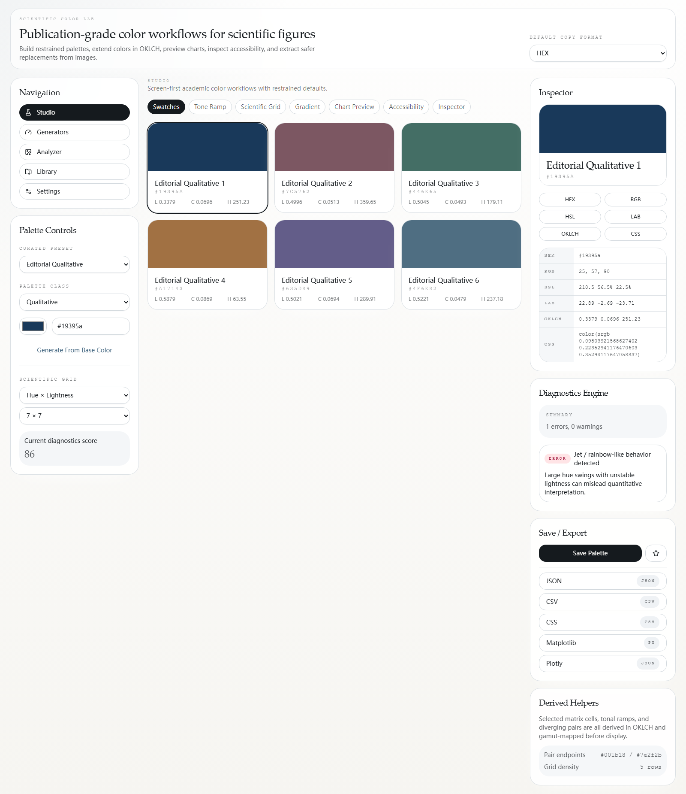
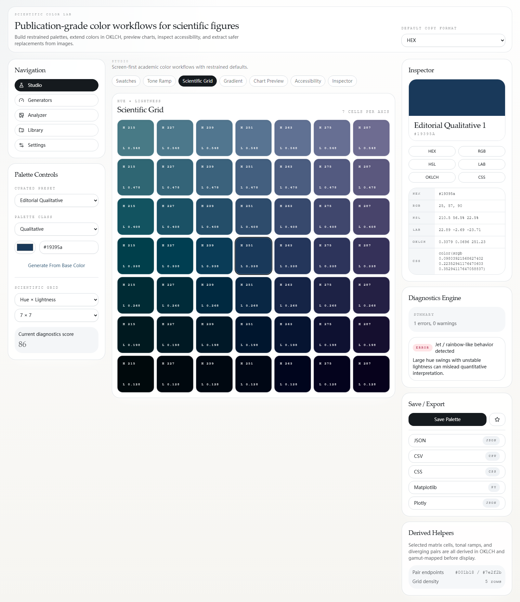
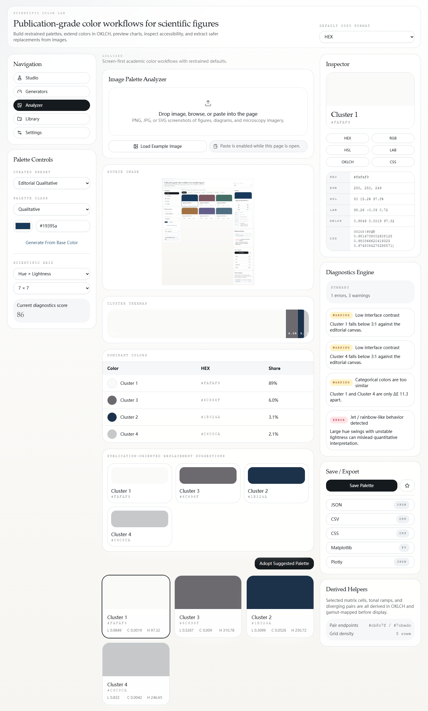
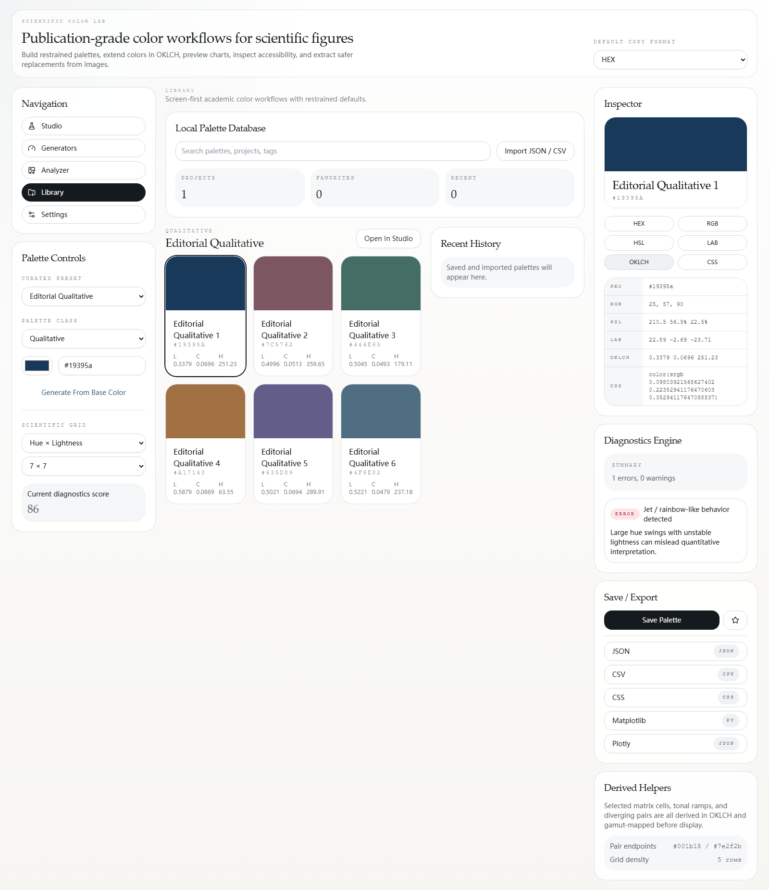

# Scientific Color Lab

## 快速入口

- 给别人安装/分享使用：[`发布给别人使用说明.md`](./发布给别人使用说明.md)
- 本地一键启动：[`启动 Scientific Color Lab.cmd`](./启动 Scientific Color Lab.cmd)

Scientific Color Lab 是一个面向科研图表、论文插图、热图、机制图和在线学术文档的专业配色工作台。  
它不是普通的取色器，而是一个强调 `科研语义 + 感知均匀 + 高效工作流 + 可分享交付` 的本地优先 Web / PWA 应用。

---

## 1. 这个软件能做什么

你可以用它来完成这些工作：

- 为折线图、散点图、柱状图生成更专业的科研配色
- 生成顺序色图、发散色图、循环色图
- 从截图、热图、论文插图、显微图片里提取主色
- 把“原始图片颜色”重构为更适合科研表达的调色板
- 检查颜色是否存在：
  - 彩虹 / jet 风险
  - 红绿冲突
  - 类别色过近
  - 顺序色图明度结构不稳
  - 发散中点过亮或过彩
  - 循环端点不闭合
- 导出到：
  - JSON
  - CSV
  - CSS Variables
  - Tailwind JSON
  - Matplotlib
  - Plotly
  - MATLAB
  - 文本摘要

---

## 2. 界面预览

### Workspace：主工作台



### Scientific Grid：颜色扩展矩阵



### Analyzer：图像颜色分析



### Library：资料库与项目管理



---

## 3. 怎么打开这个软件

### 方式 A：Windows 一键启动，最简单

在项目根目录直接双击：

- `启动 Scientific Color Lab.cmd`

这个脚本会自动：

- 检查依赖
- 如果需要会自动构建
- 启动本地预览服务
- 自动打开浏览器

默认会打开：

- [http://127.0.0.1:4173/workspace](http://127.0.0.1:4173/workspace)

这是最推荐的打开方式。

---

### 方式 B：手动启动预览版

在项目目录执行：

```bash
npm install
npm run build
npm run preview
```

然后打开：

- [http://127.0.0.1:4173/workspace](http://127.0.0.1:4173/workspace)

---

### 方式 C：开发模式

如果你要边开发边看效果：

```bash
npm install
npm run dev
```

然后打开：

- [http://127.0.0.1:5173/workspace](http://127.0.0.1:5173/workspace)

---

## 4. 第一次进入后怎么开始

推荐你先走这条最短路径：

1. 打开 `Workspace`
2. 在左侧设置 `Palette Class`
3. 点击中间的 `Templates`
4. 先选一个模板作为起点
5. 回到主视图后在上方 `Palette Canvas` 看整体颜色
6. 在 `High-Frequency Adjustment` 中实时调节：
   - Hue
   - Lightness
   - Chroma
   - Alpha
7. 看右侧的低干扰 `Diagnostics`
8. 如果需要，点一个 `Quick Fix`
9. 满意后保存并导出

---

## 5. 主界面怎么理解

整个软件采用三栏结构：

### 左栏：轻量导航与入口

包含：

- Workspace
- Library
- Analyzer
- Exports
- Settings
- 语言切换
- PWA 安装入口

左栏只负责入口，不抢主工作流。

### 中栏：主工作区

这里是最核心的区域，包含：

- Palette Canvas
- 高频调色面板
- 视图切换
- 模板库
- 色板
- Tone Ramp
- Scientific Grid
- Gradient
- Pairing
- Chart Preview
- Accessibility

### 右栏：上下文辅助

主要包含：

- 调整历史
- 低干扰 Diagnostics
- Analyzer 页下的当前颜色摘要与采用动作

现在右栏不再堆很多低价值的数值信息，重点回到“颜色工作流”本身。

---

## 6. 最重要的交互规则

所有颜色视图基本都遵循同一套规则：

### 单击色块

- 立即复制 `HEX`
- 会在色块附近出现轻量提示
- 不会弹阻塞对话框

### 双击色块

- 设为当前主色

### Shift + 单击

- 加入收藏

### 拖拽色块

- 在 `Palette Canvas` 中重新排序

### 溢出菜单 / Inspector

如果需要更深的格式，可以复制：

- RGB
- HSL
- Lab
- OKLCH
- CSS

但默认工作流已经以 `HEX` 为第一优先。

---

## 7. Workspace 怎么用

### 7.1 从模板开始

最推荐的方式是：

1. 进入 `Templates`
2. 通过筛选选择：
   - 图表类型
   - 结构
   - 背景模式
   - 色数
   - 视觉语气
   - 学术用途
3. 看模板卡片上的：
   - 科学标签
   - 对比度方向
   - 为什么适合
4. 用中部的 `Current vs Candidate` 对比区预览
5. 点击 `Apply`

### 7.2 从基础色生成

左侧 `Palette Setup` 支持：

- 选 `Palette Class`
- 输入 / 选择基础色
- 点击 `Generate from base`

适合从论文封面色、实验图主色或品牌色开始扩展。

### 7.3 高频调色

`High-Frequency Adjustment` 现在和 `Palette Canvas` 在同一屏内，方便边调边看。

可实时调：

- Hue
- Lightness
- Chroma
- Alpha

支持：

- 滑块
- 数值微调
- Undo / Redo
- 当前色 / 之前颜色对比

### 7.4 视图说明

#### Swatches

看当前调色板的主要颜色。

#### Tone Ramp

看当前主色的明度阶梯。

#### Scientific Grid

查看颜色扩展矩阵：

- Hue × Lightness
- Chroma × Lightness

#### Gradient

查看顺序、发散、循环、概念图用的渐变效果。

#### Pairing

看当前主色对应的更自然、更学术的搭配建议。

#### Chart Preview

直接看颜色在：

- 折线图
- 散点图
- 柱状图
- 热图
- 概念图

里的效果。

#### Accessibility

检查：

- 灰度可读性
- 色觉缺陷下的区分性

---

## 8. Diagnostics 怎么用

Diagnostics 现在已经改成低干扰助手，而不是一大堆警告。

默认只展示：

- 当前状态
- 评分
- 最重要的 1 到 2 个问题
- 可直接点击的 Quick Fix

典型 Quick Fix 包括：

- `Reduce chroma`
- `Increase category spacing`
- `Replace red/green pair`
- `Rebuild sequential ramp`
- `Rebalance diverging midpoint`
- `Close cyclic endpoints`
- `Suggest safer template`

使用建议：

1. 先调色
2. 再看 Diagnostics 摘要
3. 如果有明显风险，先试 Quick Fix
4. 只有在需要深入排查时再展开详细诊断

---

## 9. Analyzer 怎么用

Analyzer 用于从图片中提取颜色，并给出“原始提取”和“科研重构”两种结果。

### 支持的输入方式

- 上传图片
- 拖拽图片
- 直接粘贴截图
- 加载示例图像

### 推荐操作流程

1. 打开 `Analyzer`
2. 导入图像
3. 查看：
   - Source image
   - Cluster Treemap
   - Dominant colors
   - Analysis summary
4. 在下方切换：
   - `Raw extraction`
   - `Scientific reconstruction`
5. 选择你更想带回主工作台的那一套
6. 点击 `Adopt selected palette`

### 两种结果有什么区别

#### Raw extraction

- 更接近原图颜色
- 适合参考原始风格

#### Scientific reconstruction

- 更适合论文图、图例、在线学术文档
- 更强调可读性、区分性和科学表达

---

## 10. Library 怎么用

`Library` 用来管理本地资产。

你可以在这里：

- 查看已保存调色板
- 收藏调色板
- 把调色板分配给项目
- 创建项目
- 写项目描述和备注
- 管理标签
- 查看最近记录
- 查看导出配置

推荐工作流：

1. 在 Workspace 中做好 palette
2. 点击保存
3. 进入 Library
4. 分配到具体项目
5. 后续继续复用或导出

---

## 11. Exports 怎么用

导出页支持按 `颜色 / 调色板 / 项目` 三种范围输出。

### 支持格式

- JSON
- CSV
- CSS Variables
- Tailwind JSON
- Matplotlib
- Plotly
- MATLAB
- Text Summary

### 常用操作

1. 打开 `Exports`
2. 选择 `Profile`
3. 选择导出范围
4. 选择格式和语言
5. 配置：
   - 是否包含 metadata
   - 是否包含 tags
   - notes 如何输出
   - filename template
6. 在中间预览输出内容
7. 点击 `Export now`

---

## 12. Settings 怎么用

在设置页可以调整：

- 语言
- 默认复制格式
- 背景模式
- 是否显示欢迎层
- 诊断阈值

如果你主要是科研图快速工作流，建议：

- 复制格式保持 `HEX`
- 背景模式按你常用图表环境选择
- 诊断阈值先保持默认

---

## 13. 安装为 PWA

如果你已经把项目部署到线上，推荐直接安装成 PWA。

### PWA 的好处

- 像应用一样打开
- 支持独立窗口
- 更方便分享给别人
- 不需要别人每次都跑命令

### 安装方式

1. 用 Chrome / Edge 打开部署后的地址
2. 在左侧导航找到 `Install PWA`
3. 点击安装
4. 以后可以像普通应用一样打开

---

## 14. 部署与分享

当前项目已经准备好了这些部署方式：

### Vercel

- `vercel.json` 已配置 SPA rewrite

### Netlify

- `netlify.toml` 已配置 SPA fallback

### GitHub Pages

- `.github/workflows/deploy-pages.yml` 已提供 Pages 工作流
- 同时补了 `public/404.html` 来兼容前端路由刷新

推荐分享方式：

1. 部署到 Vercel / Netlify / GitHub Pages
2. 把网址发给别人
3. 建议对方直接安装 PWA

---

## 15. 常见问题

### Q1. 我双击脚本没反应怎么办？

先确认本机已经安装：

- Node.js
- npm

然后再双击：

- `启动 Scientific Color Lab.cmd`

### Q2. 页面打不开 localhost 怎么办？

说明本地服务没启动，重新执行：

```bash
npm run preview
```

### Q3. 为什么我点颜色后只复制 HEX？

这是当前默认的高频工作流设计。  
对于大多数科研图使用场景，HEX 已经足够。

如果你需要更深格式：

- 打开 Inspector
- 或使用对应的复制入口

### Q4. 数据存在哪里？

当前是本地优先：

- 收藏
- 项目
- 最近记录
- 导出配置

都保存在浏览器本地存储 / IndexedDB 中。

### Q5. 现在是 exe 吗？

不是。  
当前推荐交付方式是：

- 部署网页
- 安装 PWA

这样更适合分享，也更符合这个项目的实际架构。

---

## 16. 开发与验证

如果你需要验证项目当前状态：

```bash
npm run typecheck
npm test
npm run build
npm run test:e2e
```

---

## 17. 当前推荐入口

### 本地使用

- [http://127.0.0.1:4173/workspace](http://127.0.0.1:4173/workspace)

### 核心起步流程

如果你是第一次使用，建议按这个顺序：

1. 打开 `Workspace`
2. 进入 `Templates`
3. 选一个高对比科研模板
4. 在 `High-Frequency Adjustment` 中微调
5. 看 `Chart Preview`
6. 看 `Diagnostics`
7. 保存
8. 去 `Exports` 导出

这条路径是当前版本最成熟、最稳定、最适合实际使用的工作流。


## 开发背景
该项目由 [Seking](mailto:shikun.creative@gmail.com) 开发，旨在满足在学术论文中需要高质量配色的需求。通过自定义开发，提供了更灵活和高效的导出功能。

如果本插件对您有所助益，恳请在 GitHub 仓库点亮 ⭐ 并予以支持捐赠；您的鼓励将成为我持续迭代和完善插件的不竭动力。


## License
[Apache 2.0](sslocal://flow/file_open?url=LICENSE&flow_extra=eyJsaW5rX3R5cGUiOiJjb2RlX2ludGVycHJldGVyIn0=) © 2025 Your Name
